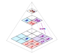

# geo-png-db
GeoPngDB is a tiled geospatial data format capable of representing global-scale data sets at high resolution in a format natively supported by web browsers.

## Concept
Data tiles are images that contain data encoded in their pixels. Tiled using the standard web tile scheme, they can provide instant access to spatial data at a practically unlimited scale. As interactive data visualization and global geospatial analysis becomes more mainstream, there is an increasing need to quickly manipulate and represent massive datasets within the browser. The scale of these datasets often makes vector datasets inefficient and unable to deliver a smooth user-experience.

Web-based "slippy" maps already take advantage of tiled imagery, and we routinely load and navigate datasets composed of trillions of data points in our browsers. We believe data tiles can provide a solution for browsing and using data effortlessly at any scale. The “GeoPngDB” format builds on existing solutions to provide a browser-friendly way of encoding raw data for consumption by web-based tools.

## Schemas

There are currently 2 schemas for GeoPngDB:

### Basic
The basic schema represents spatial data directly in each pixel and provides metadata used to interpret the data when reading the value.

#### Current Version 1.0
The current version of the basic GeoPngDB specification is 1.0. See the [GeoPngDB Basic Specification 1.0](specifications/basic/1.0/README.md) folder for detailed specs. 

A working draft with additional proposed features can be found in the [draft folder](specifications/basic/draft/1.1/README.md)

### Record Lookup
The record lookup schema uses spatial reference images along with a [png-db](https://github.com/sasakiassociates/png-db) record database to represent large geospatial datasets efficiently. Unlike the basic version which can scale indefinitely without workarounds, the record lookup schema requires some additional considerations to achieve massive scale.

#### Current Version 0.1 (beta)
The current version of the record-lookup GeoPngDB specification is 0.1 (beta). See the [GeoPngDB Record Lookup Specification 0.1](specifications/record-lookup/0.1/README.md) folder for detailed specs.

## Motivation
Raster formats are currently an underappreciated resource for sharing raw data for web-based tools. Thankfully solutions like Cloud Optimized GeoTIFFs (COGs) are poised to bring large-scale raster datasets to the main-stream for consumption in web-connected tools. However, COGs and other solutions currently require server-side processing as well as more intensive client side processing and don't take advantage of many aspects of web-based techniques and cloud-based architectures.

### Advantages of GeoPngDB

#### Inexpensive Hosting
For many public datasets, hosting costs are a major barrier. GeoPngDB tiles can be hosted statically just like any other web map tile sets. This means massive open data sets can be shared without major cost implications.

#### Browser-native image decoding
Unlike the TIFF format, browsers understand PNGs natively. Visualizations can render tiles immediately using GPU shaders without any script-based decoding. Or conventional canvas-based processing can be used to decode values for use in JavaScript.

#### PNG compression
PNG compression is lossless (which is essential for accurately representing data), but also very efficient at compressing geospatial data. 

#### True Real-Time Rendering
Removing sever requirements and keeping raw data in an image format on the client-side supports smooth updates if rendered on the GPU with shaders.

#### Dense Queries
Keeping the information as raw data allows for combining massive datasets on the fly in a web browser. This allows novel combinations of data versus representing the data as a graphic image - or as raw aerials.

#### Unlimited Scale
There are no limits to the size of dataset that can be hosted. Consideration should be given to practical limits on storage and zoom level limits from slippy map tools, but the specification imposes no limits.

#### Perfect Alignment
Standardizing on WGS 84 ([EPSG:4326](https://epsg.io/4326)) ensures all pixels are uniquely addressed and align perfectly across datasets. WGS 84 does present some challenges - such as the physical size represented by each pixel changing based on latitude, but we feel this is a worthwhile compromise and presents few practical limitations for web-based use.

#### Reliable Aggregation / Nesting
Unlike vector datasets that require aggressive simplification and loss of fidelity when zooming out, raster "pyramids" allow a simple, reliable method for accurately representing the aggregate data "beneath" each pixel. Typical aggregations can be MIN, MAX, MEAN, SUM that can be processed immediately from the tile below as illustrated in the diagram. Other statistical aggregations are possible, but require more complex processing where the original data must be available when producing each level.

Seamless, reliable aggregation makes GeoPngDB a solution for representing data originating in both vector and raster datasets. Raster aggregation from vector geometries maintains the highest spatial fidelity possible as every on-screen pixel accurately represents all values from larger zooms. By comparison, vector-based aggregation uses spatially inconsistent nesting which results in unexpected jumps for either analysis or representation. For example, think about the spatial inconsistencies when the NYC population gets distributed to all of NY state in a dot-density map.

#### Powerful Parallelization
Because each tile is represented independently as a 256x256 image, very lightweight processing can be used when generating tiles. This allows tiles to be processed in a massively parallel fashion using cloud-based architectures. Truly massive datasets can be processed in manageable chunks on affordable microservices (such as AWS Lambda or Google Cloud Functions).

## Background
Data tiles are not new and this work draws on a number of sources - most notably the work done by MapZen on their [Terrarium tile format](https://github.com/tilezen/joerd/blob/master/docs/formats.md#terrarium).

The schema for encoding data in each pixel is based on [png-db](https://github.com/sasakiassociates/png-db).

## Implementations

* [geo-png-db-processing](./geo-png-db-processing/README.md) utilities for processing PBF, GeoJson and Shapefiles into GeoPngDB tiles.
* [QGIS Plugin](https://github.com/sasakiassociates/qgis-geo-png-db) for Exporting GeoPngDB format from QGIS.
* The [Zaru](https://github.com/sasakiassociates/zaru) front-end visualization tool for consuming GeoPngDB

## Similar Solutions

### Terrarium Tiles
MapZen's terrarium tiles use the exact same WGS 84 tile scheme to represent data. Just like GeoPngDB, the terrarium format encodes values in the RGB channels of PNG images, but the integer values used to represent global elevations are not easily adapted to other use cases. GeoPngDB expands on the terrarium approach to broaden its capabilities and expand the potential uses.

### Cloud Optimized GeoTIFFs (COGs)
[COGs](https://www.cogeo.org/) provide an efficient solution for serving large GeoTIFFs via web APIs. 
* Like GeoPngDB tiles, COGs can be hosted cheaply on static storage (such as AWS S3), however to be used in web applications a backend web service is required to serve the data and respond to queries.
* It is not possible to achieve real-time feedback with COGs as all queries must be handled by a backend API.
* COGs are hosted as large TIFF files that can be impressively large, but unlikely to suitable for global high resolutions datasets. Practical limitations make this impossible to scale to the multi-petabyte data density that can feasibly be achieved with static tiles. 

### Lerc Data Tiles
[ESRI Lerc](https://github.com/Esri/lerc) "LERC is an open-source image or raster format which supports rapid encoding and decoding for any pixel type (not just RGB or Byte)". LERC is not natively understood by common browsers and requires translation, however libraries are available for a number of languages. For data tiles in a web tool, the compression advantages offered by LERC are likely offset in terms of performance by the CPU requirements to translate the files. GeoPngDB avoids this overhead by using a native format that browsers already understand.

### Open Data Cube
[Open Data Cube](https://github.com/opendatacube) "presents a common analytical framework composed of a series of data structures and tools which facilitate the organization and analysis of large gridded data collections". It provides a similar solution to COGs requiring backend services and allows sophisticated query and analysis capabilities. GeoPngDB could provide faster, cheaper access to high resolution outputs from aerial image analysis.

### PBF Vector Tiles
Vector tiles stored in the PBF format are typically stored using the same WGS 84 tile scheme. Like GeoPngDB, they are well suited to take advantage of GPU rendering on the client side and can produce beautiful graphics in real-time. Vector data is often more efficient than raster data - particularly when a vector shape spans many pixels, and the PBF format offers good compression along with fast load times. Vector tiles are an excellent solution for cartography where the readability of the map requires less detail to be rendered at lower zoom levels. 

Vector tiles can (and do) serve millions of vector shapes (such as Census blocks or road center-lines). However, they can only be served and rendered effectively when zoomed in close enough to limit the number of shapes required to be drawn. For data representation, we often want to represent data at the level at which it exists: for example block level U.S. Census data (around 7 million objects). There are no feasible vector-based solutions to represent millions of vector shapes in a web browser in real-time. Many solutions exist to simplify vector datasets to alleviate this issue (such as [shape simplification algorithms](https://en.wikipedia.org/wiki/Ramer%E2%80%93Douglas%E2%80%93Peucker_algorithm) for different zoom levels), but all come with compromises in visual fidelity and limits on practical zoom levels.

Both the data volume and the rendering overhead can make high-fidelity vector representation of large data sets infeasible at the spatial bounds of the full data set. By comparison raster solutions like GeoPngDB always load the appropriate number of pixels to represent the map on-screen and can seamlessly represent data in a pixel-perfect fashion at any scale. In addition, the simplicity and standardization of raster cells makes them well-suited for real-time combination of multiple datasets regardless of whether the source data is raster or vector. 

Most vector tiles are well suited to be rendered into GeoPngDB tiles as they use the same tiling scheme. A hybrid approach may be used to allow accurate global-scale representation of the vector tiles (using GeoPngDB) while also taking advantage of vector-enabled interactivity and rendering effects at greater zoom levels. This experience can be seamless and opaque to the end user. 

### Grid Viz
[Grid Viz](https://eurostat.github.io/gridviz/) uses CSV for data and three.js point cloud for visualisation. This is essentially a vector-based representation of raster grids allowing fast representation of large datasets. All rows must be loaded as CSV data which imposes practical record limits for big data, but three.js point clouds can allow animation or other techniques not easily achieved through direct raster representation. The approach is quite different, but included here because the capabilities may appear superficially similar.

### imMens
[imMens: Real-time Visual Querying of Big Data](https://github.com/uwdata/imMens) ([PDF paper](https://sfu-db.github.io/cmpt884-fall16/Papers/immens.pdf)) is a very similar solution for encoding data image tiles, querying and displaying them on the GPU. imMens offers sophisticated solutions for aggregation and binning, and support for 5 dimensional data cubes. The open source library is not being actively developed, but certain aspects of their approach could be useful in expanding the capabilities of "record-lookup" datasets.  
