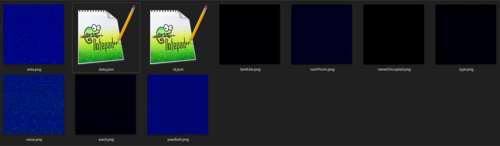
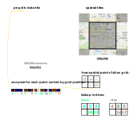
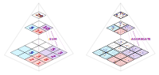
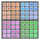
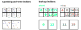
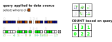
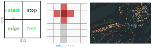

# GeoPngDB Record Lookup version 0.1 (beta)

The record lookup schema uses spatial reference images along with a [png-db](https://github.com/sasakiassociates/png-db) record database to represent large geospatial datasets efficiently. Unlike the basic version which can scale indefinitely without workarounds, the record lookup schema requires some additional considerations to achieve massive scale.

## Format

### Tiling Scheme

GeoPngDB uses the standard Google x/y/z tile schema with tiles starting in the NW corner of the WGS 84 map projection. Each tile is 256x256 pixels.

Tile schemas represent the entire globe, slicing a square map into 4 smaller tiles and adding detail at each new zoom
level. See this reference: https://www.maptiler.com/google-maps-coordinates-tile-bounds-projection/

### Record Data
A png-db database is an image database containing *non-spatial* records where each pixel represents a record. Records are uniquely identified by their position in the image with an index scanning left to right, then top to bottom. Any number of fields can be stored in this format with each column producing a different image. TEXT, INTEGER and DECIMAL data types are supported and described by metadata associated with the data image.

This screenshot shows how each column is stored as an image file. In this example of 98778 records, the images are 315x315 squares with file sizes ranging from 46 KB to 235 KB. Much larger datasets are supported: many GPUs now support 4096x4096 images which would allow 16 million records. 

### Record Lookups
When representing point records on a raster grid, multiple points may fall within a single grid cell. Each pixel of the spatial image contains a "lookup" reference to the records that fall within that cell. Records are referenced via a sequential index so that they may be directly accessed from a png-db pixel.

To account for the array of records that fall within each cell, two spatial images are used: one containing "start" values for the array, and the other containing "stop" values.

### Aggregation
At lower zoom levels, records are aggregated, so that each pixel accurately represents all pixels "below" that pixel in the pyramid. 

The basic tile schema (shown on the left side of the comparison) aggregates numeric values at each level of the pyramid. The record lookup aggregates individual records in much the same way.

### Quad-tree indexing
Each spatial cell needs to specify a range of indices in the data tile. Ideally we want to be able to use the same data tile for all spatial tiles so that it only needs to be loaded once. By using a quad-tree style ordering, we can ensure that ranges will retain the same order at different tile levels.

Note that the values here reflect order of the spatial cells used to generate indices (not the actual indices).

Each spatial cell contains a range of indices representing the records contained in that cell. For example cell 0 (top left) contains records with indices 0 through 4. This is represented by the "start" and "stop" values on the spatial tiles. Note how the "start" value in the top left cell of each 4 cell "quad" remains unchanged as we aggregate the cells to the next zoom level. The same is true for the "stop" value in the bottom right cell of the "quad". This way all records contained within a 4 cell quad are also contained by the pyramid parent of that 4 cell quad.

### Querying
In order to use record level data spatially, we need to be able to build queries based on values found in the png-db images. For example if we want to count the number of brown records in each cell, we iterate through each value in the source image based on the start and stop value for each cell. While this may seem complex, the process can be done using images entirely on a GPU shader without ever needing to access values on the CPU allowing real-time querying of millions of records. Rules can be written on the GPU to query multiple parameters across multiple png-db fields.

### Spatial Tile Structure
Spatial tiles are structured to include the start and stop reference tiles in a single image. This allows better compression, fewer http queries and fewer image "slots" on the GPU.

An optional "edge" zone allows us to include a single row of pixels from neighboring tiles. This small accommodation lets us render "plus" shapes to represent points. Though nowhere near as flexible as vector based point rendering, we've found that the plus shapes read much clearer than single pixels.

The 4th square is currently unused, but may allow future expansion.

