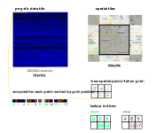
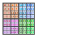
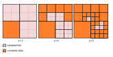
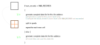
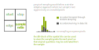

# GeoPngDB Record Lookup version 0.1 (beta)

The record lookup schema uses spatial reference images along with a [png-db](https://github.com/sasakiassociates/png-db) record database to represent large geospatial datasets efficiently. Unlike the basic version which can scale indefinitely without workarounds, the record lookup schema requires some additional considerations to achieve massive scale.

## Format

### Tiling Scheme

GeoPngDB uses the standard Google x/y/z tile schema with tiles starting in the NW corner of the WGS 84 map projection. Each tile is 256x256 pixels.

Tile schemas represent the entire globe, slicing a square map into 4 smaller tiles and adding detail at each new zoom
level. See this reference: https://www.maptiler.com/google-maps-coordinates-tile-bounds-projection/

### Record Data
A png-db database is an image database containing *non-spatial* records where each pixel represents a record. Records are uniquely identified by their position in the image with an index scanning left to right, then top to bottom. Any number of fields can be stored in this format with each column producing a different image. TEXT, INTEGER and DECIMAL data types are supported and described by metadata associated with the data image.

This screenshot shows how each column is stored as an image file. In this example of 98778 records, the images are 315x315 squares with file sizes ranging from 46 KB to 235 KB. Much larger datasets are supported: many GPUs now support 4096x4096 images which would allow 16 million records. 

### Record Lookups
When representing point records on a raster grid, multiple points may fall within a single grid cell. Each pixel of the spatial image contains a "lookup" reference to the records that fall within that cell. Records are referenced via a sequential index so that they may be directly accessed from a png-db pixel.

To account for the array of records that fall within each cell, two spatial images are used: one containing "start" values for the array, and the other containing "stop" values.

### Aggregation
At lower zoom levels, records are aggregated, so that each pixel accurately represents all pixels "below" that pixel in the pyramid. 

The basic tile schema (shown on the left side of the comparison) aggregates numeric values at each level of the pyramid. The record lookup aggregates individual records in much the same way.

### Quad-tree indexing
Each spatial cell needs to specify a range of indices in the data tile. Ideally we want to be able to use the same data tile for all spatial tiles so that it only needs to be loaded once. By using a quad-tree style ordering, we can ensure that ranges will retain the same order at different tile levels. Note that the values here reflect order of the spatial cells used to generate indices (not the actual indices).

Each spatial cell contains a range of indices representing the records contained in that cell. For example cell 0 (top left) contains records with indices 0 through 4. This is represented by the "start" and "stop" values on the spatial tiles. Note how the "start" value in the top left cell of each 4 cell "quad" remains unchanged as we aggregate the cells to the next zoom level. The same is true for the "stop" value in the bottom right cell of the "quad". This ensures that all records contained within a 4 cell quad are also contained by the pyramid parent of that 4 cell quad.

### Querying
In order to use record level data spatially, we need to be able to build queries based on values found in the png-db images. For example if we want to count the number of brown records in each cell, we iterate through each value in the source image based on the start and stop value for each cell. While this may seem complex, the process can be done using images entirely on a GPU shader without ever needing to access values on the CPU allowing real-time querying of millions of records. Rules can be written on the GPU to query multiple parameters across multiple png-db fields.

### Spatial Tile Structure
Spatial tiles are structured to include the start and stop reference tiles in a single image. Combining images allows better compression, requires fewer http queries and takes up fewer image "slots" on the GPU.

An optional "edge" zone allows us to include a single row of pixels from neighboring tiles. This small accommodation lets us render "plus" shapes to represent points. Though nowhere near as flexible as vector based point rendering, we've found that the plus shapes read much clearer than single pixels.

The 4th square is currently unused, but may allow future expansion.

# Conceptual

Unlike the record lookup solution that has been tested in proofs-of-concept and real-world use cases, the following solution is purely conceptual.

## Accommodating (actual) big data

While spatial tiles can easily accommodate billions of grid cells (the MapZen terrarium example clocks in at 70 trillion), record based solutions have limits imposed by the number of records that can be stored in the png-db. This is currently around 16 million records if your GPU supports 4096x4096 images, but more likely would be around 4 million for broader support (2048x2048 images). 

One solution would be to render an individual png-db record set for every spatial tile. This is feasible, but it would require significant data duplication as the user zooms in and out, and it still imposes limits when zoomed out to the full bounds of the dataset.

Given these constraints, the most workable solution would appear to be a sample based solution. Not every spatial tile contains the same number of records - in fact it is common for geospatial data points to be clustered in certain areas and sparse in others. The image below illustrates an adaptive sampling methodology where either full record data or sampled records exist at every zoom level.

When complete data is available, the full png-db image set can be used at that zoom level - and all zoom levels beyond it. In the case of sampled data, either a more detailed sample - or complete data will be available at the next zoom level. The following pseudo-code shows the logic for producing sample data tiles based on a given maximum number of records that we want to use for png-db images (MAX_RECORDS). "num_records" is the number of records contained within the bounds of the tile.

The same uneven distribution that occurs across tiles also occurs within tiles. Certain pixels may have a much greater record density than others. To help ensure that sparse pixels aren't filtered in a way that changes the overall impression of the image, we can adopt a per-pixel sampling strategy.

Given that millions of records will persist for any given tile, the sample data should be rich enough to allow querying and accurately represent the dataset at all zoom levels.

The one troublesome case for the sampling approach is where we have a mix of sparse data and very dense data in the same area. For example in a bird observation dataset where Canada Geese and California Condors are both represented, there may only be a handful of condor records. A filter for condors applied to the sampled data might miss key records while looking at the global scale. These records will show up once zoomed in to a level where complete data is available, but may be missed by the sampling. A workaround in this case would be to create a separate record set for the rare bird records so that they are not lost in the sampling. Multiple sources can be combined on the front-end such that the would be opaque to end users.

